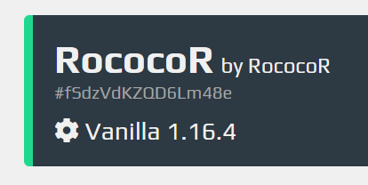

# A basic discord bot for managing [aternos](https://aternos.org/) servers

## Installation instructions

1. Make a [discord bot](https://discordpy.readthedocs.io/en/latest/discord.html).

2. Install [geckodriver](https://github.com/mozilla/geckodriver/releases) and make sure to include it in `PATH`

3. Make sure you have [Firefox](https://www.mozilla.org/en-GB/firefox/new/) installed

4. Make sure that you have [node.js](https://nodejs.org/en/) installed

5. [Clone the repository](https://www.instructables.com/Downloading-Code-From-GitHub/)

6. Go to the root directory of the project and run `npm i` to install dependencies

7. Create a file credentials.json and paste the code there: 
```json
{
    "user": "your-aternos-username",
    "password": "your-aternos-password"
}
```

8. Create a file token.txt and post the discord bot token there.

9. Go to settings.json and change the server ip.

10. Finally, if you have more than one aternos server, go to the [servers page](https://aternos.org/servers/), copy this token (shown as `fSdzVdKZQD6Lm48e` on the image).  


Paste it in the place of the token given in settings.json

## Usage

To activate the bot, run `node index.js`  

Currently, there are only 3 commands:  
/help - brings up the help message  
/status - refreshes the information about the status of the server and sends it into the chat  
/start - starts the server  